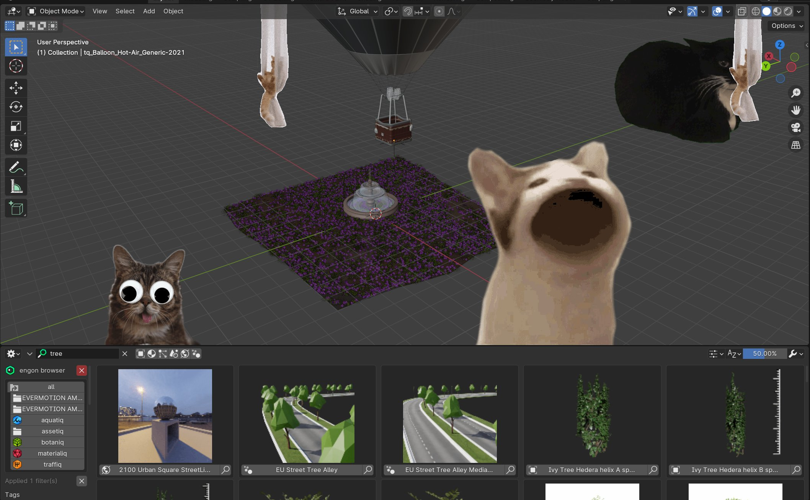

<h1 align="center">
  
</h1>

  blenderkitty
   
  <a href="https://github.com/polygoniq/blenderkitty/issues/new?assignees=&labels=bug&template=01_BUG_REPORT.md&title=bug%3A+">Report a Bug</a>
  ·
  <a href="https://github.com/polygoniq/blenderkitty/issues/new?assignees=&labels=enhancement&template=02_FEATURE_REQUEST.md&title=feat%3A+">Request a Feature</a>
  ·
  <a href="https://github.com/polygoniq/blenderkitty/issues/new?assignees=&labels=question&template=04_SUPPORT_QUESTION.md&title=support%3A+">Ask a Question</a>

 

*A 20 years of collaborative experience well spent.*

## Features:
- ~150 cats taking over your Blender
- Improves productivity by exactly 72.85%
- Reduces anxiety
- Meowing, purring included
- Renown, battle tested, well maintained addon

## Getting Started

### Prerequisites

> You need [Blender 3.3 LTS or higher](https://blender.org). Windows, macOS 10 and Linux are
> supported.

### Installation

#### Download the addon ZIP

|                          Stable Release                                                  |                         Unstable Master Branch                   |
| :--------------------------------------------------------------------------------------: | :--------------------------------------------------------------: |
| Head over to [Releases](https://github.com/polygoniq/blenderkitty/releases) for a stable ZIP.  | Click `Code` -> `Download ZIP` if you are feeling adventurous.   |

#### Install ZIP in Blender

Go to `Edit` -> `Preferences`. And select `Add-ons` in the left bar. Click the `Install...` button
in the top section. Select the ZIP file you just downloaded and click `Install Add-on`. After the
installation finishes, check the checkbox next to the `blenderkitty` addon.

### Updating

The addon can auto-update itself to latest stable or even unstable master version. Head over to
`Edit` -> `Preferences` and select `Add-ons` in the left bar. Type `blenderkitty` into the search bar
and then expand the addon section of `blenderkitty`. Scroll down to the auto update section to set up
update intervals or even update manually.

## Support

Reach out to the maintainers at one of the following places:

- Joining our [Discord community](https://polygoniq.com/discord/) for the fastest support.
- [GitHub issues](https://github.com/polygoniq/blenderkitty/issues/new?assignees=&labels=question&template=04_SUPPORT_QUESTION.md&title=support%3A+)
- Contact options listed on [this GitHub profile](https://github.com/polygoniq)

## Project assistance

If you want to say **thank you** or/and support active development of blenderkitty:

- Add a [GitHub Star](https://github.com/polygoniq/blenderkitty) to the project.
- Tweet about blenderkitty.

Together, we can make `blenderkitty` **better**!

## License

This project is licensed under the **GNU General Public License v3**.

See [LICENSE](LICENSE) for more information.